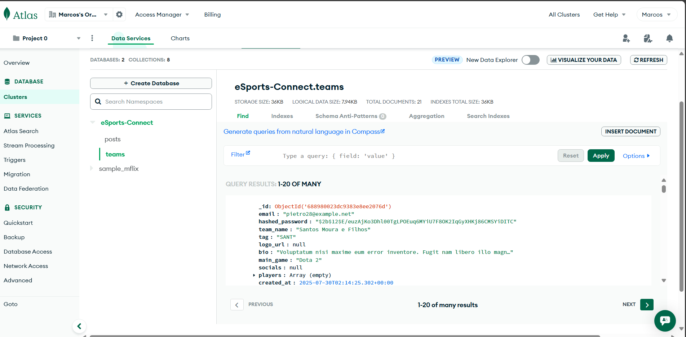
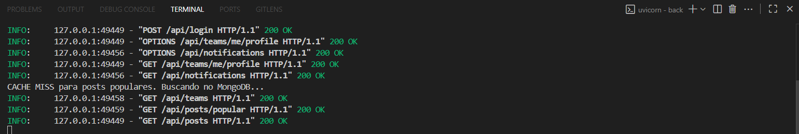
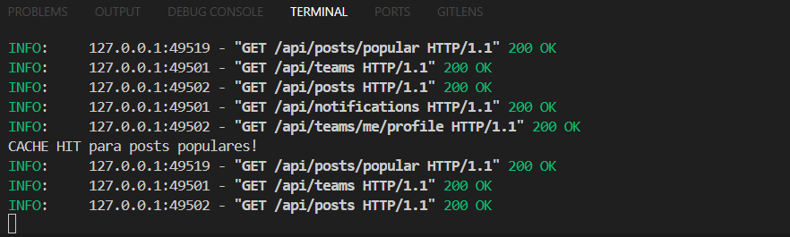
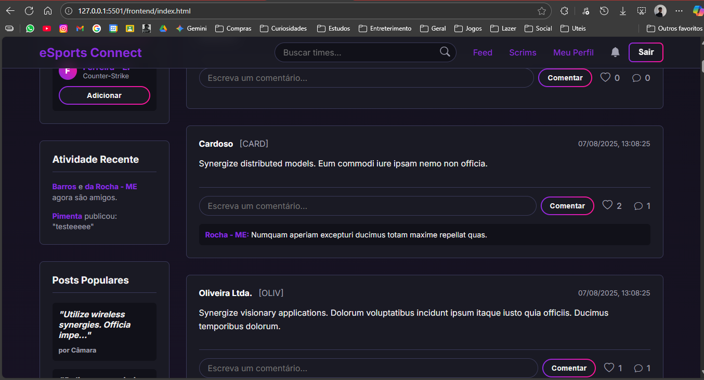

# Rede Social eSports Team
É uma rede social que busca conectar todas as equipes de jogos online, com uma comunidade ampla

# Para o professor:

## Atividade 29/07 (Populate)
o caminho do script de populate é:
`\back\populate.py`

Foi criado:

```
NUMBER_OF_TEAMS = 20
NUMBER_OF_POSTS = 50
NUMBER_OF_SCRIMS = 25
```

print da imagem do atlasdb:



## Atividade 07/08 (index)

a criação do index foi feita da seguinte forma:

dentro do `\back\app\db.py` temos:

```
# TEAM
await Team.get_motor_collection().create_index("email", unique=True)
await Team.get_motor_collection().create_index("team_name", unique=True)

# PLAYER
await Player.get_motor_collection().create_index("nickname", unique=True)

# POST
await Post.get_motor_collection().create_index("created_at")
await Post.get_motor_collection().create_index("author")

# SCRIM
await Scrim.get_motor_collection().create_index("proposing_team")
await Scrim.get_motor_collection().create_index("opponent_team")
await Scrim.get_motor_collection().create_index("scrim_datetime")
await Scrim.get_motor_collection().create_index("game")
await Scrim.get_motor_collection().create_index("status")

```

que cria e define os indices do banco de dados, em conjunto com a definição dentro das classes
que estão em `\back\app\models.py`

por exemplo na classe de `player` temos:
`nickname: str = Indexed(str, unique=True)`

assim para cada atributo que precisa de index de cada classe

## Atividade 21/08 (Redis cache)

Como foi implementado?

### Instalação e Configuração:

A biblioteca `redis` foi adicionada ao projeto (`pip install "redis[hiredis]"`).

A URL de conexão Redis Cloud foi adicionada ao arquivo `.env` e `app/config.py`:

### Módulo de Cache (`\back\app\cache.py`):

Primeiro foi criado o arquivo `\back\app\cache.py` para a definição e gerenciamento da conexão com o Redis. Este módulo cria um "pool" de conexões assíncronas que pode ser reutilizado por toda a aplicação.

### Integração com o Ciclo de Vida do FastAPI (`\back\main.py`):

A função `lifespan` foi atualizada para garantir que as conexões com o Redis sejam encerradas de forma limpa quando a aplicação é desligada.

A Lógica de Cache na Rota de Posts Populares
A rota `GET /api/posts/popular` foi refatorada para implementar o padrão "Cache-Aside":

### Verificação no Cache (Cache Hit):
Quando a rota é chamada, ela primeiro pergunta ao Redis se já existe um resultado salvo para a chave `"popular_posts"`. Se existir, ela retorna os dados diretamente do Redis.

```
    # Define a chave do cache
    cache_key = "popular_posts"
    # Tenta obter o resultado do cache
    cached_result = await redis_client.get(cache_key)
    
    if cached_result:
        # Cache HIT (Encontrou no cache)
        print("CACHE HIT para posts populares!")
        # Converte o texto JSON de volta para uma lista de objetos e retorna.
        return json.loads(cached_result)
```

Busca no Banco (Cache Miss):
Se os dados não estiverem no cache, a aplicação executa a consulta `Aggregation Pipeline` no MongoDB, que é uma operação mais lenta.

No terminal, isso é indicado pela mensagem:
`CACHE MISS para posts populares. Buscando no MongoDB...`



Salvando no Cache com Expiração:

Após buscar os dados do MongoDB, a aplicação os salva no Redis.

Trecho da rota `/posts/popular` em `routes.py`
```
posts = await Post.aggregate(pipeline, projection_model=PostOut).to_list()

await redis_client.set(
cache_key,
json.dumps([p.model_dump(mode='json') for p in posts]),
ex=300 
)
```

Ao apertar f5 vemos isso acontecer:


No terminal do servidor, isso é indicado pela mensagem:
`CACHE HIT para posts populares!`


OBS: O parâmetro `ex=300` garante que o cache seja automaticamente invalidado após 5 minutos. Isso força a aplicação a buscar uma nova lista de posts populares periodicamente, mantendo os dados atualizados sem sobrecarregar o banco de dados a cada requisição.

## Atividade 28/08 (Stream Redis)

Para tornar a plataforma mais dinâmica e interativa, foi implementado o **Redis Streams** para criar um feed de "Atividade Recente" em tempo real.



### O que é Redis Streams?

É uma estrutura de dados do Redis que funciona como um "log de eventos". A aplicação pode adicionar novos eventos a esse log, e os clientes (como o front-end) podem ler os eventos mais recentes para mostrar o que está acontecendo na plataforma.

### Como foi implementado?

**1. Publicando Eventos no Back-end (`\back\app\routes.py`):**
As rotas que representam ações importantes foram modificadas para "anunciar" um evento no stream chamado `activity_stream` sempre que são executadas com sucesso.

* **Ao criar um novo post (`POST /posts`):**

```
  # ... (lógica para salvar o post) ...
  event_data = {
      "type": "new_post",
      "team_name": current_team.team_name,
      "content_preview": (post.content[:50] + '...') # Preview do conteúdo
  }
  await redis_client.xadd("activity_stream", event_data)
  
```

* **Ao aceitar um pedido de amizade (`POST /friends/accept/...`):**

```
  # ... (lógica para criar a amizade) ...
  event_data = {
      "type": "new_friendship",
      "team1_name": current_team.team_name,
      "team2_name": requester_team.team_name
  }
  await redis_client.xadd("activity_stream", event_data)
  
```

**2. Lendo os Eventos (Nova Rota):**
Foi criada uma nova rota pública para que o front-end possa ler os últimos eventos do mural.

* **`GET /api/activity-stream`**:

```
  @router.get("/activity-stream", tags=["Activity Stream"])
  async def get_activity_stream(redis_client: ...):
      """Lê e retorna os últimos 15 eventos do stream de atividades."""
      # xrevrange lê o stream em ordem reversa (do mais novo para o mais antigo)
      events = await redis_client.xrevrange("activity_stream", count=15)
      # ... (formata a resposta) ...
      return formatted_events
  
```
**3. Exibindo no Front-end (`\frontend\assets\js\home.js`):**
O script da página principal foi atualizado para chamar a nova rota `/activity-stream` e renderizar os eventos no widget "Atividade Recente".

```
// Trecho da função fetchAndRenderActivityStream em home.js
async function fetchAndRenderActivityStream() {
    // ... (busca na API) ...
    activityStreamList.innerHTML = events.map(event => {
        const data = event.data;
        let text = 'Evento desconhecido.';
        
        // Cria um texto diferente para cada tipo de evento
        if (data.type === 'new_post') {
            text = `<strong>${data.team_name}</strong> publicou: "${data.content_preview}"`;
        } else if (data.type === 'new_friendship') {
            text = `<strong>${data.team1_name}</strong> e <strong>${data.team2_name}</strong> agora são amigos.`;
        }
        
        return `<li>${text}</li>`;
    }).join('');
}

```

Essa implementação permite que o feed de atividades seja atualizado em tempo real, refletindo as ações dos usuários na plataforma


## Atividade 04/09 (Neo4j + GDS)

Para trazer funcionalidades de **recomendação de times** mais inteligentes, foi integrado o **Neo4j** com a biblioteca **Graph Data Science (GDS)**.

### 1. Instalação e Configuração (Docker)

O Neo4j foi configurado em container Docker para facilitar o uso do GDS.  
As credenciais de acesso foram adicionadas ao arquivo `.env` e lidas no projeto pela classe `Settings`:

```python
class Settings(BaseSettings):
    # Variáveis de ambiente (.env)
    MONGODB_URI: str
    DATABASE_NAME: str
    SECRET_KEY: str
    ALGORITHM: str
    ACCESS_TOKEN_EXPIRE_MINUTES: int
    REDIS_URL: str
    NEO4J_URI: str
    NEO4J_USERNAME: str
    NEO4J_PASSWORD: str

    # Configuração do Pydantic
    model_config = SettingsConfigDict(env_file=".env", extra='ignore')
```

### 2. Implementação no Back-end

Foi criado o arquivo `\back\app\gds.py`, responsável por encapsular as funções de recomendação baseadas no **Graph Data Science**:

- **`get_similar_teams(team_id)`** → Utiliza o algoritmo **Node Similarity**, recomendando times com base em amigos em comum.  
- **`get_top_teams_by_pagerank(team_id)`** → Utiliza o **PageRank**, destacando os times mais populares/influentes.

### 3. Rota de Recomendação

No arquivo `routes.py`, foi criada a rota **`/teams/recommendations`**, que une os dois algoritmos em uma estratégia híbrida:

```python
@router.get("/teams/recommendations", response_model=List[Dict], tags=["Teams & Profiles"])
async def get_team_recommendations(
    current_team: Annotated[Team, Depends(get_current_team)]
):
    """
    (GDS Híbrida) Retorna uma lista de times recomendados.
    - Se o usuário tiver amigos, tenta a recomendação por Similaridade.
    - Se a Similaridade não retornar resultados ou se o usuário for novo,
      usa o PageRank como fallback para recomendar os times mais populares.
    """
    await current_team.fetch_link(Team.friends)

    recommendations = []

    # Recomendação personalizada por Similaridade
    if len(current_team.friends) > 1:
        print("INFO: Usuário com amigos. Tentando recomendação por SIMILARIDADE.")
        recommendations = await get_similar_teams(str(current_team.id))

    # Fallback: Popularidade via PageRank
    if not recommendations:
        if len(current_team.friends) <= 1:
            print("INFO: Usuário novo ou com poucos amigos. Usando recomendação por POPULARIDADE (PageRank).")
        else:
            print("INFO: Similaridade não retornou resultados. Usando fallback para POPULARIDADE (PageRank).")

        recommendations = await get_top_teams_by_pagerank(str(current_team.id))

    return recommendations
```

### 4. Front-end Atualizado

No `\frontend\assets\js\home.js`, o código foi ajustado para consumir a nova rota e exibir as recomendações de times na página inicial.
